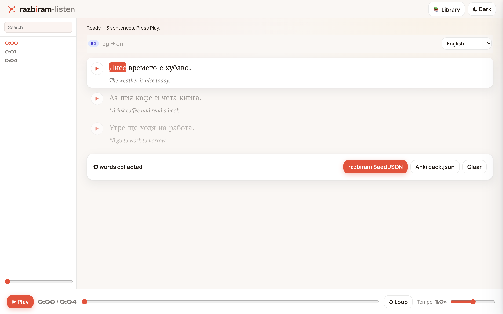
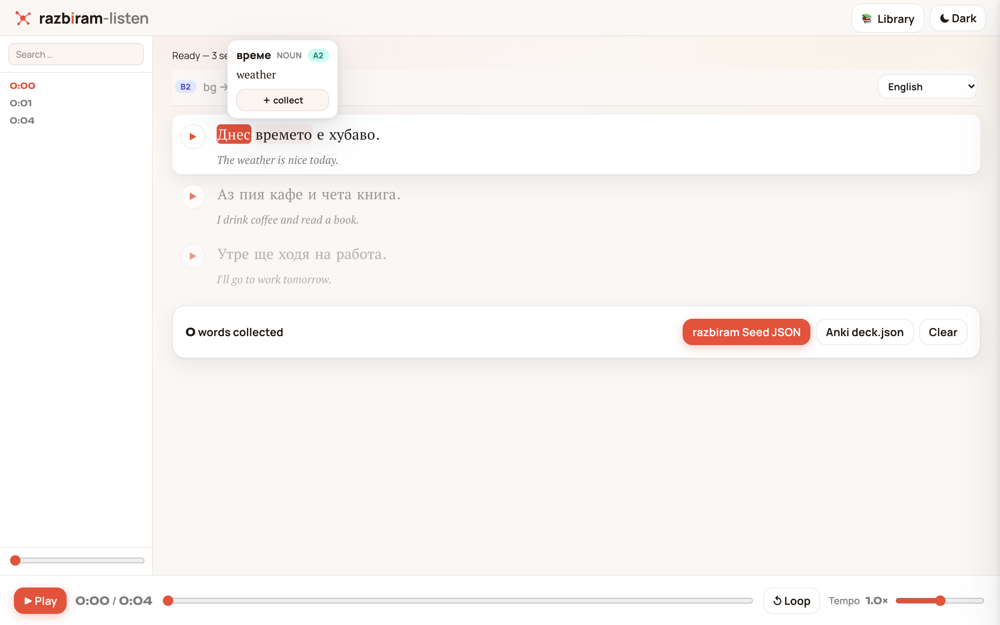
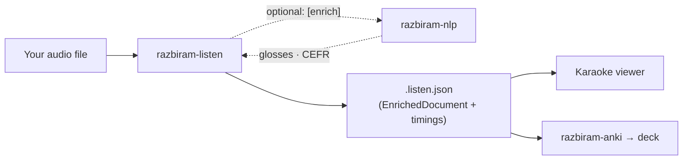

# razbiram-listen

**Listen to any Bulgarian audio and understand it word by word — locally, privately, with a learning loop.**

[](https://github.com/leonkoellerwirth-arch/razbiram-listen/actions/workflows/ci.yml)
[](LICENSE)


[](https://github.com/leonkoellerwirth-arch/razbiram-nlp)

<p align="center">
  <picture>
    <source media="(prefers-color-scheme: dark)" srcset="docs/img/hero-dark.png" />
    
  </picture>
</p>
<p align="center">
  <em>Drop an audio file → read it word by word, synced to the audio. The current word
  glows, each line carries its translation, and one click collects a vocabulary card.</em>
</p>

Bring your own audio (a podcast, an audiobook, your own recording); razbiram-listen
transcribes it locally with Whisper, aligns every word to the audio, and plays it
back in a synced **Karaoke reading view**: the current word highlighted, one click
to seed a vocabulary card. That core runs on its own. Install the optional
[razbiram-nlp](https://github.com/leonkoellerwirth-arch/razbiram-nlp) plugin
(`pip install "razbiram-listen[enrich]"`) and it lights up with **glosses, lemma,
part of speech, and heuristic CEFR bands** — the two tools simply help each other.

<p align="center">
  
</p>
<p align="center">
  <em>Hover any word for its lemma, part of speech, a heuristic CEFR band and a
  gloss — one click collects it as a vocabulary card.</em>
</p>

## Why BYO-audio

Lyrics and streaming transcripts are copyright-protected content, and fetching
them from third-party services is off the table — legally and by design. This
tool only ever processes audio **you already have**: your own recordings, or
freely (CC) licensed material. For podcasts and audiobooks — the audio learners
actually study from — that is exactly the normal case.

## Part of the razbiram ecosystem

razbiram-nlp is the **enrichment engine**; razbiram-anki is the **card bridge**;
razbiram-listen is the **audio entry gate**. All three speak one contract — the
`EnrichedDocument` JSON (here extended with audio timings). razbiram-listen owns
the transcript + timing; razbiram-nlp is an **optional plugin** that enriches it.



- Engine / hub: [razbiram-nlp](https://github.com/leonkoellerwirth-arch/razbiram-nlp)
- Card bridge: [razbiram-anki](https://github.com/leonkoellerwirth-arch/razbiram-anki)

## Quickstart

**The easy way — one step.** Start the studio, then drag an audio file into the
browser; it transcribes and syncs it for you, with a live progress bar. No files
to juggle, no flags to type. Everything stays on your machine.

```bash
# Core: transcript + timing + karaoke (no plugin needed)
pip install git+https://github.com/leonkoellerwirth-arch/razbiram-listen

# Optional: add glosses + CEFR via the razbiram-nlp plugin
pip install "razbiram-listen[enrich] @ git+https://github.com/leonkoellerwirth-arch/razbiram-listen"

razbiram-listen studio        # opens the browser; drop an audio file → read it
```

In the studio a drop transcribes and translates to **English by default** (full
analysis + CEFR, needs the `[enrich]` plugin + a local Ollama model, with honest
"sentence X of N" progress). Switch the dropdown to Deutsch, or to *nur Transkript*
for an instant transcript-only pass. You can also **change the translation language
later** on any saved entry (EN ⇄ DE) — it reuses the stored transcript, so there is
no re-transcription and the karaoke timings stay intact.

### Queue & library — big files, saved for replay

A song is quick; a film is not. The studio processes every drop as a **background
job** shown in a queue panel beside the reader — drop several files and they run in
parallel (bounded; `RAZBIRAM_LISTEN_WORKERS`, default 2). A short one auto-opens when
done; a long one keeps running while you read something else.

Every result is **saved locally** to a personal **library** (`$RAZBIRAM_LISTEN_HOME`,
default `~/.razbiram-listen`) — the transcript *and* your audio — so you can replay it
any time with one click, no re-dropping. Delete an entry, or just remove its audio to
reclaim space (the transcript stays). Everything is on your machine: no upload, no
cloud (local-first, BYO-audio).

<details>
<summary>Power-user / scripting: the CLI</summary>

```bash
# Core: a synced transcript, no plugin required
razbiram-listen process --audio episode.mp3 --out episode.listen.json

# Enriched: add glosses + CEFR (needs the [enrich] plugin)
razbiram-listen process --audio episode.mp3 --gloss de --out episode.listen.json
# then open the viewer and load episode.listen.json + episode.mp3 (local, no upload)
```
</details>

### Sources: local files or open URLs — never platforms

Give `process` **one** source:

- `--audio path.mp3` — a local file you already have, or
- `--url <direct-audio-URL | podcast-RSS>` — an **open** source you have rights to
  (a direct audio file, or a podcast RSS enclosure; add `--episode N` to pick one).
  The tool fetches only that one named file, then transcribes locally.

**Streaming/DRM platforms (YouTube, Spotify, SoundCloud, …) are refused** — those
hosts are blocked and platform pages are never resolved to media. That is by
design (see "Why BYO-audio"): razbiram-listen only touches audio that is yours or
openly licensed.

### Glosses & CEFR — the optional `[enrich]` plugin, fully local

Transcription and alignment are always offline and need no plugin. Enrichment
(glosses, lemma/POS, CEFR) is the **optional razbiram-nlp plugin**:

```bash
pip install "razbiram-listen[enrich] @ git+https://github.com/leonkoellerwirth-arch/razbiram-listen"
```

Glosses (`--gloss de`/`en`, which imply `--enrich`) then use a **local LLM via
[Ollama](https://ollama.com)** — no cloud. Pick the model with `--gloss-model`
(e.g. a multilingual one like `aya-expanse:8b`):

```bash
razbiram-listen process --audio ep.mp3 --gloss de --gloss-model aya-expanse:8b --out ep.listen.json
```

With the plugin installed, stages still degrade gracefully to what your machine has:

- **Morphology** (lemma / part of speech, and sharper CEFR) needs the optional
  `classla` extra: `pip install classla` (downloads a Bulgarian model once).
- **Difficulty / vocab** (document + per-word CEFR bands) need the hub's data files;
  set `RAZBIRAM_NLP_DATA_DIR` / `RAZBIRAM_NLP_CONFIG_DIR` to a razbiram-nlp checkout.
- Without either, you still get sentence-level translations.
- Without the plugin at all, you still get the full synced-transcript karaoke.

## What it produces

A single `.listen.json` — an `EnrichedDocument` (imported un-forked from the hub)
extended with:

- `schemaVersion` — SemVer of the document shape (currently `1.0.0`);
- `audioRef` — the source **filename** and duration (never the audio itself);
- `timings` — per-token and per-sentence playback windows, so the viewer syncs
  text to audio.

The audio stays on your machine; only a reference to its filename is stored.

## Methodology — evaluated, not assumed

Alignment (mapping Whisper word timings onto razbiram tokens) is this tool's
quality heart, so it is tested against a **Golden-Set** of short, hand-verified
own-audio snippets — the same evaluator discipline razbiram-nlp uses for glosses.
Every change to `align.py` runs against it. CEFR bands and glosses are **heuristic
approximations**, never certification.

## Roadmap (planned, not promised)

- Transcript-edit mode in the viewer (correct a word, re-enrich the sentence) —
  Whisper makes mistakes, and the tool should be honest about it.
- Spotify **metadata only** via the official Web API (now-playing / cover) —
  never text content.
- AnkiConnect push; additional languages.

## Disclaimer & licence

Local-first: no server upload, no telemetry. CEFR/gloss labels are heuristic.
"Spotify" and "Anki" are trademarks of their respective owners; razbiram-listen is
not affiliated with them. Licensed under the **MIT License** — see [LICENSE](LICENSE).

---

Built by [Leon Köllerwirth Hlihel](https://leon-koellerwirth.com) — AI governance &
agentic engineering in regulated environments.
[Website](https://leon-koellerwirth.com) · [LinkedIn](https://www.linkedin.com/in/leon-k%C3%B6llerwirth-hlihel-642506197/)
