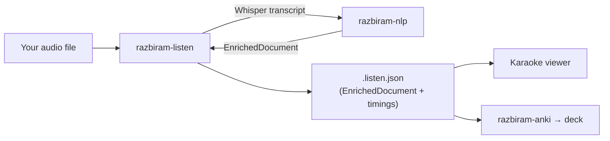

# razbiram-listen

**Listen to any Bulgarian audio and understand it word by word — locally, privately, with a learning loop.**

Bring your own audio (a podcast, an audiobook, your own recording); razbiram-listen
transcribes it locally with Whisper, enriches the transcript through the
[razbiram-nlp](https://github.com/leonkoellerwirth-arch/razbiram-nlp) engine
(lemma, part of speech, gloss, heuristic CEFR band), and plays it back in a synced
**Karaoke reading view**: the current word highlighted, hover for meaning, one
click to seed a vocabulary card.

<!-- M7: animated GIF of the Karaoke view (light + dark) goes here — the feature sells visually or not at all. -->


## Why BYO-audio

Lyrics and streaming transcripts are copyright-protected content, and fetching
them from third-party services is off the table — legally and by design. This
tool only ever processes audio **you already have**: your own recordings, or
freely (CC) licensed material. For podcasts and audiobooks — the audio learners
actually study from — that is exactly the normal case.

## Part of the razbiram ecosystem

razbiram-nlp is the **engine**; razbiram-anki is the **card bridge**;
razbiram-listen is the **audio entry gate**. All three speak one contract — the
`EnrichedDocument` JSON (here extended with audio timings).



- Engine / hub: [razbiram-nlp](https://github.com/leonkoellerwirth-arch/razbiram-nlp)
- Card bridge: [razbiram-anki](https://github.com/leonkoellerwirth-arch/razbiram-anki)

## Quickstart

> Milestone M1 (models + scaffold) is in place; the `process` command lands in M4.
> Once it does, the flow is three steps:

```bash
pip install git+https://github.com/leonkoellerwirth-arch/razbiram-listen
razbiram-listen process --audio episode.mp3 --gloss de --out episode.listen.json
# then open the viewer and pick episode.listen.json + episode.mp3 (local, no upload)
```

## What it produces

A single `.listen.json` — an `EnrichedDocument` (imported un-forked from the hub)
extended with:

- `schemaVersion` — SemVer of the document shape (currently `1.0.0`);
- `audioRef` — the source **filename** and duration (never the audio itself);
- `timings` — per-token and per-sentence playback windows, so the viewer syncs
  text to audio.

The audio stays on your machine; only a reference to its filename is stored.

## Methodology — evaluated, not assumed

Alignment (mapping Whisper word timings onto razbiram tokens) is this tool's
quality heart, so it is tested against a **Golden-Set** of short, hand-verified
own-audio snippets — the same evaluator discipline razbiram-nlp uses for glosses.
Every change to `align.py` runs against it. CEFR bands and glosses are **heuristic
approximations**, never certification.

## Roadmap (planned, not promised)

- Transcript-edit mode in the viewer (correct a word, re-enrich the sentence) —
  Whisper makes mistakes, and the tool should be honest about it.
- Spotify **metadata only** via the official Web API (now-playing / cover) —
  never text content.
- AnkiConnect push; additional languages.

## Disclaimer & licence

Local-first: no server upload, no telemetry. CEFR/gloss labels are heuristic.
"Spotify" and "Anki" are trademarks of their respective owners; razbiram-listen is
not affiliated with them. Licensed under the **MIT License** — see [LICENSE](LICENSE).

---

Built by [Leon Köllerwirth Hlihel](https://leon-koellerwirth.com) — AI governance &
agentic engineering in regulated environments.
